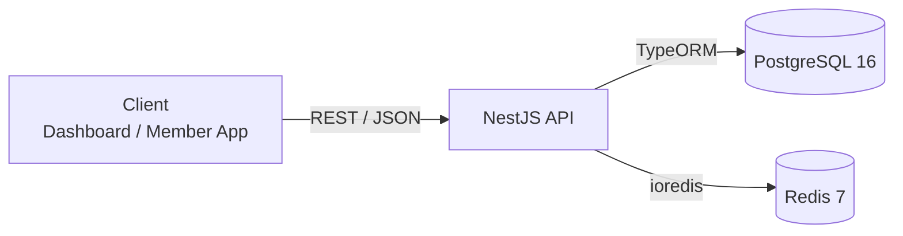
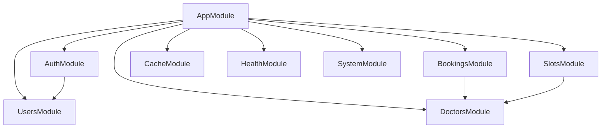

<p align="center">
  
</p>

<h1 align="center">🏥 Clinic Booking API</h1>

<p align="center">
  <strong>NestJS REST API for the Clinic Appointment Booking System</strong>
</p>

<p align="center">
  <a href="#"></a>
  <a href="#"></a>
  <a href="#"></a>
  <a href="#"></a>
  <a href="#"></a>
  <a href="#"></a>
  <a href="#"></a>
  <a href="#"></a>
  <a href="#"></a>
</p>

---

## 📖 Table of Contents

- [Overview](#-overview)
- [Tech Stack](#-tech-stack)
- [Architecture](#-architecture)
- [Getting Started](#-getting-started)
- [Scripts](#-scripts)
- [API Documentation](#-api-documentation)
- [Project Structure](#-project-structure)
- [Environment Variables](#-environment-variables)
- [Database](#-database)
- [Testing](#-testing)
- [Security](#-security)
- [Contributing](#-contributing)

---

## 🏗️ Overview

This is the backend API for the **Clinic Appointment Booking System (P1)** — part of a Turborepo monorepo (`@clinic-platform/api`). It handles:

- 🔐 **Authentication** — JWT access/refresh token with rotation, bcrypt password hashing
- 👥 **User Management** — Patient/Doctor/Admin roles with RBAC
- 🩺 **Doctor Profiles** — Specialties, license, consultation fees
- 📅 **Time Slot Management** — Availability windows with overlap detection
- 📋 **Appointment Booking** — State machine with pessimistic locking to prevent double-booking
- 📊 **Audit Trail** — Immutable booking status transition logs
- ⚡ **Caching** — Redis-based cache for frequently accessed doctor data
- 📨 **Event-Driven** — `@nestjs/event-emitter` for async side-effects (notifications)

---

## 🛠️ Tech Stack

| Category            | Technology                              |
| ------------------- | --------------------------------------- |
| **Runtime**         | Node.js 20+                             |
| **Framework**       | NestJS 11                               |
| **Language**        | TypeScript 5 (strict mode)              |
| **Database**        | PostgreSQL 16                           |
| **Cache / Tokens**  | Redis 7 (via `ioredis`)                 |
| **ORM**             | TypeORM 0.3 (migrations, decorators)    |
| **Auth**            | Passport.js + `@nestjs/jwt` (HS256)     |
| **Validation**      | `class-validator` + `class-transformer` |
| **Logger**          | Pino via `@clinic-platform/logger`      |
| **Testing**         | Vitest + `@nestjs/testing`              |
| **API Docs**        | Swagger (OpenAPI 3) — auto-generated    |
| **Security**        | Helmet, Throttler, bcrypt               |
| **Package Manager** | pnpm 10 (workspace)                     |
| **Build**           | SWC (via `@swc/cli`)                    |

---

## 🏛️ Architecture



### Module Dependency Graph



---

## 🚀 Getting Started

### Prerequisites

- **Node.js** ≥ 20
- **pnpm** ≥ 10
- **PostgreSQL** 16
- **Redis** 7

### Installation

```bash
# From monorepo root
pnpm install

# Copy environment file
cp apps/api/.env.example apps/api/.env
# Edit .env with your local database credentials
```

### Run Development Server

```bash
# From monorepo root
pnpm --filter @clinic-platform/api dev

# Or from this directory
pnpm dev
```

The API will be available at `http://localhost:8080/api/v1`

### Run with Docker Compose

```bash
# Start PostgreSQL + Redis
docker compose up -d postgres redis

# Run API in dev mode
pnpm --filter @clinic-platform/api dev
```

---

## 📜 Scripts

| Script                    | Description                            |
| ------------------------- | -------------------------------------- |
| `pnpm dev`                | Start in watch mode (hot reload)       |
| `pnpm build`              | Build for production                   |
| `pnpm start:prod`         | Run production build                   |
| `pnpm lint`               | Run ESLint (`--max-warnings 0`)        |
| `pnpm check-types`        | TypeScript type checking               |
| `pnpm test`               | Run unit tests (Vitest)                |
| `pnpm test:watch`         | Run tests in watch mode                |
| `pnpm test:coverage`      | Run tests with coverage report         |
| `pnpm migration:generate` | Generate migration from entity changes |
| `pnpm migration:run`      | Run pending migrations                 |
| `pnpm migration:revert`   | Revert last migration                  |
| `pnpm seed`               | Seed development data                  |

---

## 📚 API Documentation

Swagger UI is auto-generated and available in non-production environments:

```
http://localhost:8080/api/docs
```

### Endpoints Overview

| Module       | Endpoint                       | Auth             |
| ------------ | ------------------------------ | ---------------- |
| **Auth**     | `POST /auth/register`          | 🔓 Public        |
|              | `POST /auth/login`             | 🔓 Public        |
|              | `POST /auth/refresh`           | 🔓 Public        |
|              | `POST /auth/logout`            | 🔒 JWT           |
| **Users**    | `GET /users/me`                | 🔒 JWT           |
|              | `PATCH /users/me/profile`      | 🔒 JWT           |
|              | `GET /users`                   | 🔒 Admin         |
| **Doctors**  | `GET /doctors`                 | 🔒 JWT           |
|              | `GET /doctors/:id`             | 🔒 JWT           |
|              | `POST /doctors`                | 🔒 Admin         |
|              | `PATCH /doctors/:id`           | 🔒 Owner/Admin   |
| **Slots**    | `POST /doctors/:id/slots`      | 🔒 Owner/Admin   |
|              | `POST /doctors/:id/slots/bulk` | 🔒 Owner/Admin   |
|              | `GET /doctors/:id/slots`       | 🔒 JWT           |
| **Bookings** | `POST /bookings`               | 🔒 Patient/Admin |
|              | `GET /bookings`                | 🔒 Scoped        |
|              | `GET /bookings/:id`            | 🔒 Scoped        |
|              | `PATCH /bookings/:id/status`   | 🔒 Role-based    |
| **Health**   | `GET /health/live`             | 🔓 Public        |
|              | `GET /health/ready`            | 🔓 Public        |
| **System**   | `GET /system/info`             | 🔓 Public        |

---

## 📂 Project Structure

```
src/
├── main.ts                           # Bootstrap, global pipes, Swagger
├── app.module.ts                     # Root module, global config
├── config/                           # Environment configuration
│   ├── database.config.ts
│   ├── redis.config.ts
│   └── jwt.config.ts
├── common/                           # Shared infrastructure
│   ├── cache/                        # Redis cache service
│   ├── decorators/                   # @Public(), @Roles(), @CurrentUser()
│   ├── filters/                      # HttpExceptionFilter
│   ├── interceptors/                 # TransformInterceptor (envelope)
│   ├── helpers/                      # Pagination utilities
│   └── types/                        # Enums, interfaces
├── modules/
│   ├── auth/                         # JWT, Passport, login/register
│   ├── users/                        # User CRUD, profiles
│   ├── doctors/                      # Doctor profiles, specialties
│   ├── slots/                        # Time slot management
│   ├── bookings/                     # Booking CRUD, state machine, events
│   │   ├── events/                   # BookingCreatedEvent
│   │   ├── listeners/                # BookingsListener (notifications)
│   │   └── repositories/             # AppointmentsRepository
│   ├── health/                       # Liveness/readiness probes
│   └── system/                       # System info endpoint
└── database/
    ├── migrations/                   # TypeORM migration files
    └── seeds/                        # Development seed data
```

---

## 🔐 Environment Variables

Copy `.env.example` to `.env` and configure:

| Variable                 | Default                 | Description                             |
| ------------------------ | ----------------------- | --------------------------------------- |
| `NODE_ENV`               | `development`           | Environment                             |
| `PORT`                   | `8080`                  | API port                                |
| `CORS_ORIGIN`            | `http://localhost:5173` | Allowed CORS origins (comma-separated)  |
| `DB_HOST`                | `localhost`             | PostgreSQL host                         |
| `DB_PORT`                | `5432`                  | PostgreSQL port                         |
| `DB_NAME`                | `clinic_booking`        | Database name                           |
| `DB_USER`                | `postgres`              | Database user                           |
| `DB_PASSWORD`            | `secret`                | Database password                       |
| `REDIS_HOST`             | `localhost`             | Redis host                              |
| `REDIS_PORT`             | `6379`                  | Redis port                              |
| `JWT_ACCESS_SECRET`      | —                       | JWT access token secret (min 32 chars)  |
| `JWT_REFRESH_SECRET`     | —                       | JWT refresh token secret (min 32 chars) |
| `JWT_ACCESS_EXPIRES_IN`  | `15m`                   | Access token expiry                     |
| `JWT_REFRESH_EXPIRES_IN` | `7d`                    | Refresh token expiry                    |
| `BCRYPT_ROUNDS`          | `12`                    | Bcrypt cost factor                      |

---

## 🗄️ Database

### Migrations

```bash
# Generate migration from entity changes
pnpm migration:generate src/database/migrations/AddSomething

# Apply migrations
pnpm migration:run

# Revert last migration
pnpm migration:revert
```

### Seed Data

```bash
pnpm seed
```

Creates default accounts:

- **Admin:** `admin@clinic.local` / `Admin@123`
- **Doctor:** `dr.nguyen@clinic.local` / `Doctor@123`
- **Patient:** `patient@example.com` / `Patient@123`

---

## 🧪 Testing

The project uses **Vitest** with `@nestjs/testing`:

```bash
# Run all tests
pnpm test

# Watch mode
pnpm test:watch

# Coverage report
pnpm test:coverage
```

### Test Structure

- **Unit tests** — co-located as `*.spec.ts` alongside source files
- **E2E tests** — located in `test/` directory
- **Mocking** — Uses `vi.fn()`, `vi.mock()`, `vi.spyOn()` (Vitest globals)

---

## 🛡️ Security

| Feature                  | Implementation                                                      |
| ------------------------ | ------------------------------------------------------------------- |
| **Authentication**       | JWT (HS256) with access/refresh token pair                          |
| **Token Storage**        | Refresh token hashed (bcrypt) in Redis with TTL                     |
| **Password Hashing**     | bcrypt with cost factor 12                                          |
| **RBAC**                 | Global `RolesGuard` with `@Roles()` decorator                       |
| **Rate Limiting**        | `@nestjs/throttler` — 100 req/min default                           |
| **Security Headers**     | Helmet (X-Frame-Options, HSTS, etc.)                                |
| **Input Validation**     | Global `ValidationPipe` — whitelist + forbidNonWhitelisted          |
| **Output Serialization** | `ClassSerializerInterceptor` with `@Exclude()` on sensitive fields  |
| **SQL Injection**        | Parameterized queries via TypeORM                                   |
| **Double-booking**       | `SELECT FOR UPDATE` pessimistic lock + `UNIQUE(slot_id)` constraint |

---

## 🤝 Contributing

1. Follow the rules in [`RULES.md`](../../RULES.md) at the repo root
2. Run `pnpm lint` and `pnpm check-types` before submitting
3. Write tests for new features
4. Use conventional commits

---

## 📄 License

This project is private and proprietary. All rights reserved.
