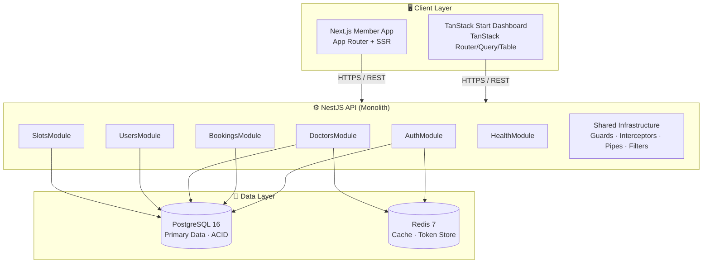
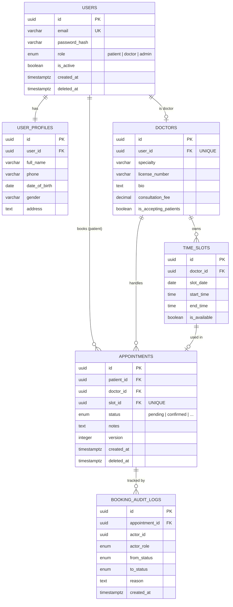
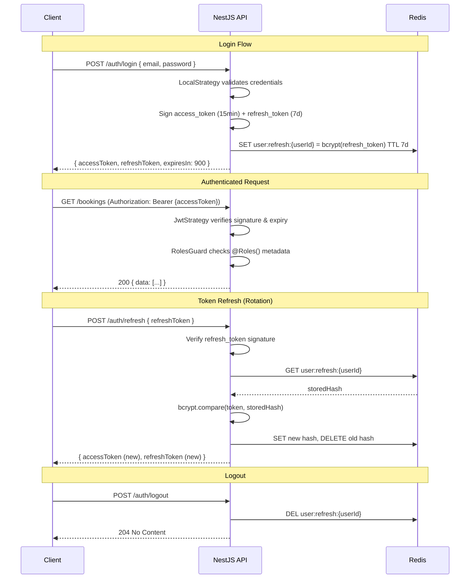
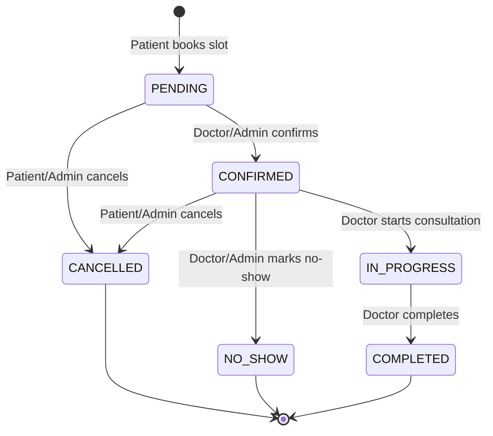

# P1 — Clinic Appointment Booking System

### Master Documentation

> **Project code:** `CLINIC-BOOKING-P1`
> **Version:** 1.1.0
> **Status:** ✅ Complete
> **Last updated:** 2026-03-31

---

## Overview

The Clinic Appointment Booking System is a full-stack healthcare platform that digitizes the appointment lifecycle between patients, doctors, and clinic administrators. This is **Project 1 (P1)** in a progressive 5-project roadmap toward a full-scale multi-clinic SaaS platform.

P1 establishes the core foundation: authentication, role-based access control, doctor/patient data model, time slot management, and booking state management. All subsequent projects (P2–P5) build directly on this foundation.

---

## Documentation Index

| #   | File                                                   | Description                                               | Audience              |
| --- | ------------------------------------------------------ | --------------------------------------------------------- | --------------------- |
| 1   | [PRD — Product Requirements](./01-PRD.md)              | Goals, user stories, acceptance criteria, out-of-scope    | PM, Team Lead         |
| 2   | [System Architecture](./02-system-architecture.md)     | Tech stack, layers, module structure, deployment overview | Tech Lead, Full-stack |
| 3   | [Database Schema](./03-database-schema.md)             | ERD, table definitions, indexes, constraints, seed data   | Backend, DBA          |
| 4   | [API Specification](./04-api-specification.md)         | All endpoints, request/response shapes, error codes       | Backend, Frontend     |
| 5   | [Auth & Security](./05-auth-and-security.md)           | JWT strategy, RBAC, refresh rotation, token storage       | Backend, Security     |
| 6   | [Booking State Machine](./06-booking-state-machine.md) | States, transitions, guards, business rules, audit        | Backend, PM           |

---

## System Architecture

---

## Database ERD

---

## JWT Authentication Flow

---

## Booking State Machine

---

## Project Deliverables

| Deliverable            | Description                                            |
| ---------------------- | ------------------------------------------------------ |
| NestJS REST API        | Core backend with all modules                          |
| Vite + React Dashboard | Internal admin + doctor management UI (TanStack Start) |
| Next.js Member Web App | Patient-facing appointment portal (SSR)                |
| PostgreSQL schema      | Migrations via TypeORM                                 |
| API documentation      | Swagger UI auto-generated                              |
| Seed data              | Dev + staging environment seeds                        |

---

## Timeline

| Week   | Focus                                                             |
| ------ | ----------------------------------------------------------------- |
| Week 1 | Project scaffolding, DB schema, Auth module (login, JWT, refresh) |
| Week 2 | Doctor module, Patient module, time slot generation               |
| Week 3 | Booking module, state machine, booking APIs                       |
| Week 4 | Dashboard UI, Member web app, integration testing, Swagger docs   |

---

## Key Design Decisions

1. **Single `users` table** with a `role` enum — patients and doctors share the same identity table; `doctors` and `user_profiles` are extension tables. This simplifies auth and allows users to have multiple roles in the future.

2. **Booking state machine** is a dedicated service — transition logic lives in `BookingStateMachine`, not in controllers. Every transition validates the actor's role before executing.

3. **Refresh token rotation** — refresh tokens are stored hashed (bcrypt) in Redis with a TTL. Every refresh issues a new pair and invalidates the old one, preventing replay attacks.

4. **Soft deletes** — no hard deletes on medical-related data. `deleted_at` timestamps everywhere; data is retained for audit and compliance.

5. **UUID v4** primary keys on all tables — avoids sequential ID enumeration attacks.

---

## Glossary

| Term          |                                                                Definition |
| ------------- | ------------------------------------------------------------------------: |
| Appointment   |                        A confirmed booking between a patient and a doctor |
| Time slot     |                  A fixed-duration availability window defined by a doctor |
| Booking       | The act of a patient requesting a time slot (may be pending or confirmed) |
| Admin         |                                  Clinic staff with full management access |
| Patient       |                                  A registered user who books appointments |
| Doctor        |            A registered user who owns time slots and handles appointments |
| Rotation      |       The process of replacing a refresh token with a new one on each use |
| State machine |       The logic engine that controls valid appointment status transitions |
